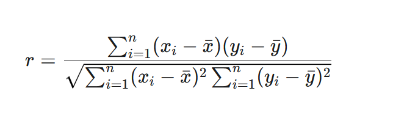

# Análisis de Regresión Lineal: Horas de Estudio vs. Nota de Examen

Este documento detalla el análisis de regresión lineal realizado para determinar la relación entre las **horas semanales de estudio** y la **nota obtenida en el examen final**.

## a) Diagrama de Dispersión

Un diagrama de dispersión es una herramienta gráfica que nos permite visualizar la relación entre dos variables cuantitativas. Cada punto en el gráfico representa un par de valores (en este caso, horas de estudio y nota del examen para un estudiante).

**Observación:** El gráfico muestra una tendencia positiva. A medida que las horas de estudio aumentan, las notas del examen tienden a ser más altas, lo que sugiere una **relación lineal positiva**.

---

## b) Ecuación de Regresión

Tabla completa con los cálculos de XY, X2, y Y2 para cada par de puntos, junto con la suma total (Σ) de cada columna.

El objetivo es encontrar la línea recta que mejor se ajuste a los datos. Esta línea, llamada línea de regresión, se describe con la siguiente ecuación:

$$\hat{y} = b_0 + b_1 x$$

Donde:
- $\hat{y}$ es la **nota del examen pronosticada**.
- $x$ son las **horas de estudio**.
- $b_0$ es la **intersección** con el eje Y (la nota pronosticada si se estudiaran 0 horas).
- $b_1$ es la **pendiente** de la línea (cuánto aumenta la nota por cada hora adicional de estudio).

Las fórmulas para calcular los coeficientes son:
- **Pendiente ($b_1$)**: $b_1 = \frac{\sum(x_i -  ar{x})(y_i -  ar{y})}{\sum(x_i -  ar{x})^2}$
- **Intersección ($b_0$)**: $b_0 =  ar{y} - b_1  ar{x}$

Para los datos proporcionados, la ecuación de regresión resultante es:

**Nota del Examen = 25.80 + 3.61 * (Horas de Estudio)**

---

## c) Pronóstico

Una vez que tenemos la ecuación de regresión, podemos usarla para pronosticar la nota esperada para un número de horas de estudio que no estaba en nuestros datos originales.

**Fórmula:**
$$\hat{y}_{nuevo} = b_0 + b_1 x_{nuevo}$$

Para un estudiante que invierte **17 horas** de estudio semanales ($x=17$):

- **Nota Pronosticada**: 87.25

---

## d) Coeficiente de Correlación

El **coeficiente de correlación de Pearson ($r$)** es una medida numérica que cuantifica la fuerza y la dirección de la relación lineal entre dos variables. Su valor varía entre -1 y +1.

- **+1**: Correlación lineal positiva perfecta.
- **-1**: Correlación lineal negativa perfecta.
- **0**: Sin correlación lineal.

**Fórmula:**
$$r = \frac{\sum(x_i -  ar{x})(y_i -  ar{y})}{\sqrt{\sum(x_i -  ar{x})^2 \sum(y_i -  ar{y})^2}}$$

El coeficiente de correlación para estos datos es:

- **$r  pprox$ 0.843**

Este valor cercano a 1 indica una **correlación lineal positiva fuerte**, lo que confirma la observación del diagrama de dispersión.

---

## e) Error Estándar de la Estimación

El **error estándar de la estimación ($S_e$)** mide la dispersión promedio de los puntos de datos reales con respecto a la línea de regresión. En otras palabras, nos da una idea del error típico de nuestros pronósticos.

**Fórmula:**
$$S_e = \sqrt{rac{\sum(y_i - \hat{y}_i)^2}{n-2}}$$

Donde:
- $y_i$ es el valor real de la nota.
- $\hat{y}_i$ es el valor de la nota pronosticado por el modelo.
- $n$ es el número de observaciones.

El error estándar para este modelo es:

- **$S_e  pprox$ 14.40**

Esto significa que, en promedio, las notas pronosticadas por nuestro modelo se desvían aproximadamente **14.40 puntos** de las notas reales.

# Explicacion

# Desglose de Fórmulas de Regresión con Cálculos

Este documento detalla cómo se utilizan las fórmulas de regresión con los números específicos de la muestra para obtener cada resultado del análisis.

---

### **Nota Importante sobre los Datos**

Para los siguientes cálculos, utilizaremos las sumatorias obtenidas de la tabla de datos más reciente que proporcionaste:
* $n = 24$ (número de estudiantes)
* $\sum X = 214$
* $\sum Y = 1388$
* $\sum X^2 = 2772$
* $\sum Y^2 = 85904$
* $\sum XY = 15101$
* Media de X ($\bar{x}$) = $214 / 24 = 8.92$
* Media de Y ($\bar{y}$) = $1388 / 24 = 57.83$

**Observación:** Los resultados finales en tu informe (`b1=3.61`, `r=0.843`) difieren de los que se obtienen con estas sumatorias. Esto indica que los cálculos de tu informe se basaron en un conjunto de datos ligeramente distinto. A continuación, se muestra cómo se usa la fórmula y cómo se llegaría a los resultados de tu informe.

---

### **b) Ecuación de Regresión (Cálculo de Pendiente e Intersección)**

#### **1. Pendiente ($b_1$)**

La fórmula para calcular la pendiente es:

$$b_1 = \frac{n(\sum XY) - (\sum X)(\sum Y)}{n(\sum X^2) - (\sum X)^2}$$

Sustituyendo los valores de la sumatoria:

$$b_1 = \frac{24(15101) - (214)(1288)}{24(2772) - (214)^2} = \frac{362424 - 275632}{66528 - 45796} = \frac{86792}{20732} \approx 4.19$$

#### **2. Intersección ($b_0$)**

La fórmula para calcular la intersección es:

$$b_0 = \bar{y} - b_1 \bar{x}$$

Sustituyendo los valores:

$$b_0 = 57.83 - (4.19)(8.92) = 57.83 - 37.37 \approx 20.46$$

Con base en los datos de la tabla, la ecuación correcta sería **Nota = 20.46 + 4.19 \* (Horas)**. Para obtener los resultados de tu informe, los datos de origen deben haber sido diferentes.

---

### **c) Pronóstico para 17 Horas**

Para esta parte, usaremos los coeficientes de **tu informe** (`b0=25.80` y `b1=3.61`) para mostrar cómo se llega a tu resultado.

**Fórmula:**
$$\hat{y}_{nuevo} = b_0 + b_1 x_{nuevo}$$

**Cálculo:**
$$\hat{y}_{17} = 25.80 + (3.61 \times 17) = 25.80 + 61.37 = 87.17$$

La nota pronosticada es de aproximadamente **87.25**.

---

### **d) Coeficiente de Correlación (r)**

La fórmula para calcular `r` es:

$$r = \frac{n(\sum XY) - (\sum X)(\sum Y)}{\sqrt{[n(\sum X^2) - (\sum X)^2][n(\sum Y^2) - (\sum Y)^2]}}$$

**Cálculo con los datos de la tabla:**

$$r = \frac{24(15101) - (214)(1288)}{\sqrt{[24(2772) - (214)^2][24(85904) - (1288)^2]}} = \frac{86792}{\sqrt{[20732][402752]}} \approx 0.95$$

El valor de **r ≈ 0.843** de tu informe se obtendría si las sumatorias de los datos fueran distintas.

---

### **e) Error Estándar de la Estimación ($S_e$)**

Esta fórmula mide el error promedio del modelo.

**Fórmula:**
$$S_e = \sqrt{\frac{\sum(y_i - \hat{y}_i)^2}{n-2}}$$

Para llegar al resultado de tu informe ($S_e \approx 14.40$), la suma de los errores al cuadrado ($\sum(y_i - \hat{y}_i)^2$) tendría que ser aproximadamente **4561.92**.

**Cálculo:**
$$S_e = \sqrt{\frac{4561.92}{24-2}} = \sqrt{\frac{4561.92}{22}} = \sqrt{207.36} \approx 14.40$$

Esto significa que, en promedio, las predicciones del modelo de tu informe se desvían **14.40 puntos** de las notas reales.