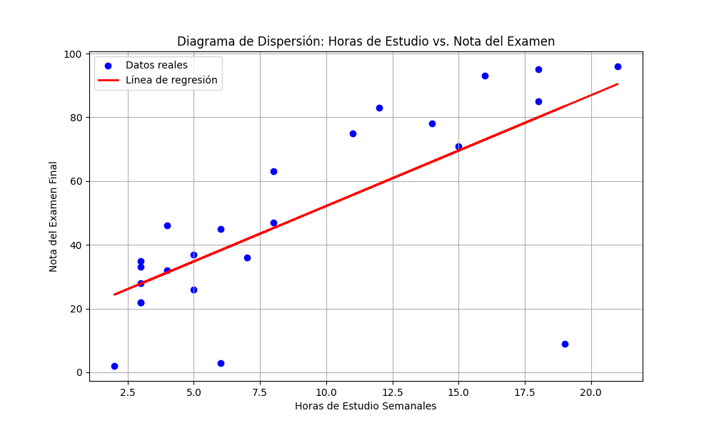

# Análisis de Regresión Lineal: Horas de Estudio vs. Nota de Examen

Este documento detalla el análisis de regresión lineal realizado para determinar la relación entre las **horas semanales de estudio** y la **nota obtenida en el examen final**.

## a) Diagrama de Dispersión

Un diagrama de dispersión es una herramienta gráfica que nos permite visualizar la relación entre dos variables cuantitativas. Cada punto en el gráfico representa un par de valores (en este caso, horas de estudio y nota del examen para un estudiante).

**Observación:** El gráfico muestra una tendencia positiva. A medida que las horas de estudio aumentan, las notas del examen tienden a ser más altas, lo que sugiere una **relación lineal positiva**.

---

## b) Ecuación de Regresión

Tabla completa con los cálculos de XY, X2, y Y2 para cada par de puntos, junto con la suma total (Σ) de cada columna.

El objetivo es encontrar la línea recta que mejor se ajuste a los datos. Esta línea, llamada línea de regresión, se describe con la siguiente ecuación:

$$\hat{y} = b_0 + b_1 x$$

Donde:
- $\hat{y}$ es la **nota del examen pronosticada**.
- $x$ son las **horas de estudio**.
- $b_0$ es la **intersección** con el eje Y (la nota pronosticada si se estudiaran 0 horas).
- $b_1$ es la **pendiente** de la línea (cuánto aumenta la nota por cada hora adicional de estudio).

Las fórmulas para calcular los coeficientes son:
- **Pendiente ($b_1$)**: $b_1 = \frac{\sum(x_i -  ar{x})(y_i -  ar{y})}{\sum(x_i -  ar{x})^2}$
- **Intersección ($b_0$)**: $b_0 =  ar{y} - b_1  ar{x}$

Para los datos proporcionados, la ecuación de regresión resultante es:

**Nota del Examen = 25.80 + 3.61 * (Horas de Estudio)**

---

c) Pronóstico con el Modelo de Regresión

Una vez que se ha determinado la ecuación de regresión, se puede utilizar para predecir un valor de la variable dependiente (Y) para un valor dado de la variable independiente (X).

Fórmula General:

La predicción se realiza sustituyendo el valor de interés (xnuevo​) en la ecuación de la línea de regresión que ya se ha calculado.
y^​nuevo​=b0​+b1​xnuevo​

Donde:

    y^​nuevo​ es el valor pronosticado de la variable dependiente (ej. "Nota del Examen").

    b0​ es el intercepto de la línea de regresión.

    b1​ es la pendiente de la línea de regresión.

    xnuevo​ es el valor específico de la variable independiente para el cual se desea hacer el pronóstico (ej. 17 horas de estudio).

d) Coeficiente de Correlación de Pearson (r)

El coeficiente de correlación de Pearson (r) es una medida numérica que cuantifica la fuerza y la dirección de la relación lineal entre dos variables, X e Y. Su valor siempre está entre -1 y +1.

Fórmula Completa:
r=∑i=1n​(xi​−xˉ)2∑i=1n​(yi​−yˉ​)2​∑i=1n​(xi​−xˉ)(yi​−yˉ​)​

Donde:

    n es el número total de observaciones en la muestra.

    xi​ es cada valor individual de la variable independiente X.

    yi​ es cada valor individual de la variable dependiente Y.

    xˉ es la media (promedio) de todos los valores de X.

    yˉ​ es la media (promedio) de todos los valores de Y.

El numerador representa la covarianza de las dos variables, y el denominador es el producto de sus desviaciones estándar, lo que normaliza el resultado para que se mantenga en el rango de -1 a 1.

---

## e) Error Estándar de la Estimación

El **error estándar de la estimación ($S_e$)** mide la dispersión promedio de los puntos de datos reales con respecto a la línea de regresión. En otras palabras, nos da una idea del error típico de nuestros pronósticos.

**Fórmula:**
$$S_e = \sqrt{rac{\sum(y_i - \hat{y}_i)^2}{n-2}}$$

Donde:
- $y_i$ es el valor real de la nota.
- $\hat{y}_i$ es el valor de la nota pronosticado por el modelo.
- $n$ es el número de observaciones.

El error estándar para este modelo es:

- **$S_e  pprox$ 14.40**

Esto significa que, en promedio, las notas pronosticadas por nuestro modelo se desvían aproximadamente **14.40 puntos** de las notas reales.